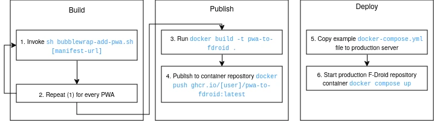

## PWA to F-Droid

Publish your locally hosted PWAs as an F-Droid repository to install via F-Droid on any Android device.

### Motivations

Android has excellent support for PWA (Progressive Web Applications), but unfortunately the option for PWA creation within the Chrome web browser is locked behind Google Play Services & requires a connected Google Account.

PWA to F-Droid allows you to publish all of your self-hosted PWAs as [Trusted Web Activity](https://developer.chrome.com/docs/android/trusted-web-activity) APKs and then serve them to your Android device via [F-Droid](https://f-droid.org/en/).

This is different to using Chrome's (or similar) "Add to homescreen" feature, which simply adds a shortcut to your device homescreen. This project converts your PWAs into installable APKs which has a few benefits, such as offline operation and support for [intents](https://developer.android.com/guide/components/intents-common).

### Overview

You must build and publish your own version of the docker image for hosting as the repository is made up of static files which are built once and then distributed via a method of your choosing (AWS, Azure, your basement, etc). It's very easy though.

### Installation

_WIP_